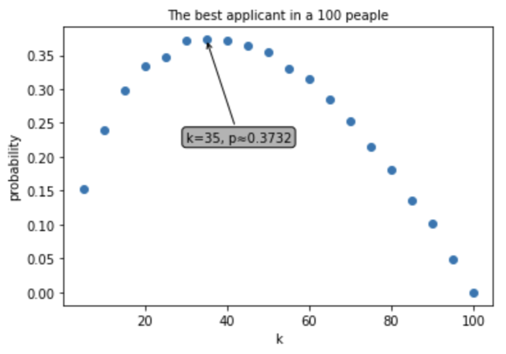

# Strategic Approaches to Optimal Selection Problems

In this analysis, we consider a scenario where a manager must select the best candidate from `n` candidates. Candidates are interviewed sequentially in random order, and the decision to accept or reject each candidate is made immediately after the interview. Once a candidate is rejected, they cannot be reconsidered. During the process, the manager gathers information on the candidates interviewed but lacks information about the quality of the remaining candidates.

The strategy examined involves rejecting the first `k` candidates and then selecting the first candidate who is better than any of these `k` rejected candidates. 

## Analysis

1. **Setting**: For `n = 100` and `100,000` trials, we aim to determine the optimal value of `k` that maximizes the probability of selecting the best candidate. We define a function to calculate this probability for various `k` values and use a scatter plot to identify the maximum probability and the corresponding `k`.

   

   The plot shows that the maximum probability occurs at `k = 35`.

2. **Variation**: Setting `k` to the Napierian number (Euler's number, `e`), we explore candidate numbers ranging from `3` to `100` and analyze the probabilities for different `k` values.

   

   Finding the best value of k also using mathematical equations: $x = \frac{1}{e}$
